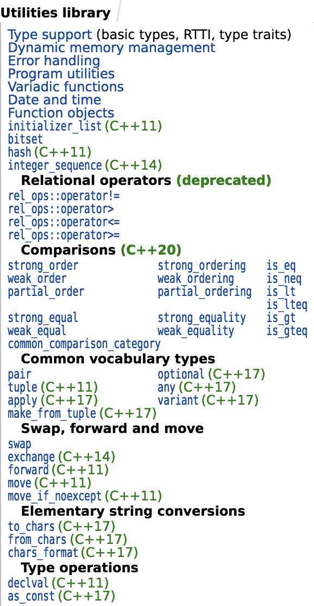
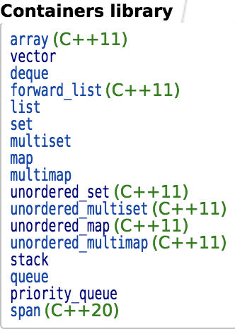
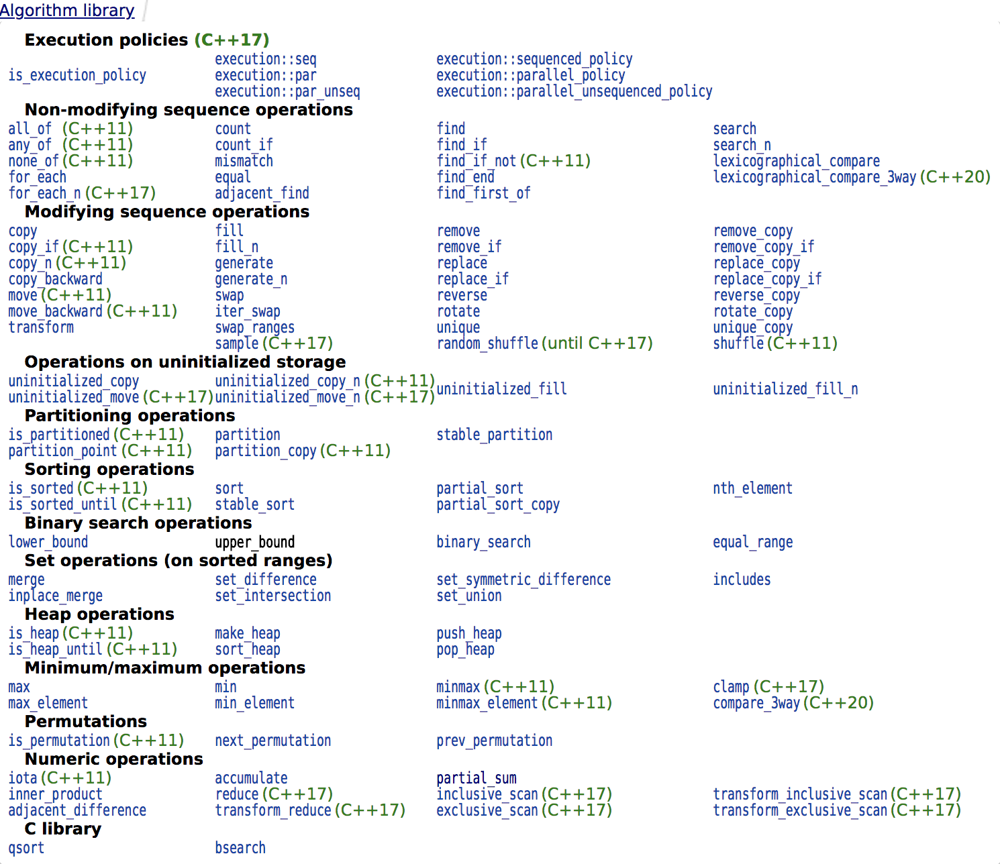

# basicCSKnowledge
Some C++ usages and built-in classes and functions.

### Built-in

If you can user these built-in functions expertly, you can solve many questions easily, I think.

[Utility library](http://en.cppreference.com/w/cpp/utility#General-purpose_utilities) :

[Containers library](http://en.cppreference.com/w/cpp/algorithm):

[Algorithms library](http://en.cppreference.com/w/cpp/algorithm):

### Reference

Some C++ knowledge websites: [cppreference](http://en.cppreference.com/w/), [cplusplus](http://www.cplusplus.com/) and [GeeksforGeeks](https://www.geeksforgeeks.org/c-plus-plus/)
